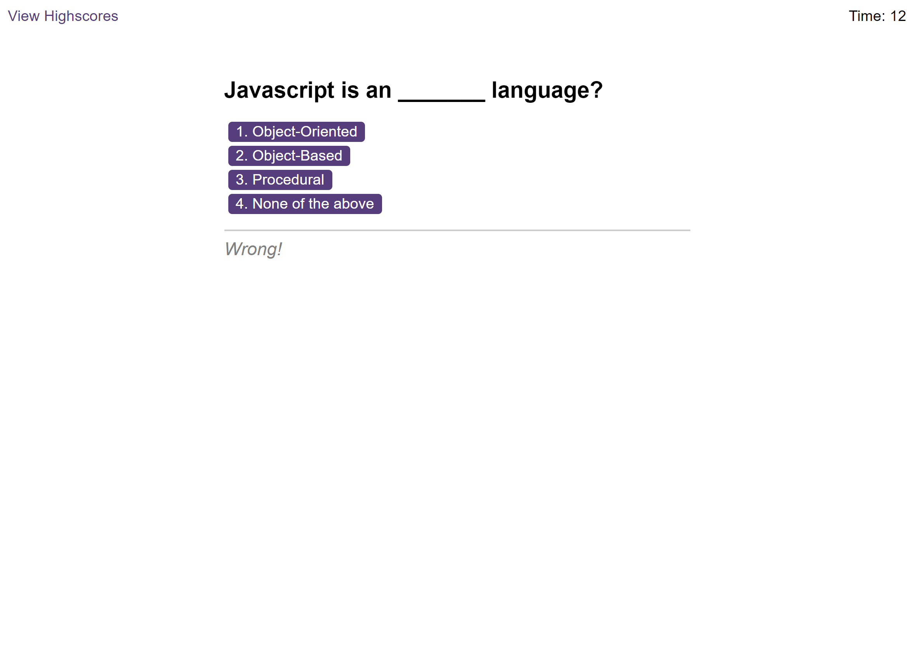

 

  <h1 align="center">Vanilla JS Code Quiz</h1>
  

    A timed coding quiz with multiple-choice questions that run in the browser.
     
    <a href="https://osmantolo.github.io/code_quiz-web_apis-javascript/">View Demo</a>
  

## About The Project

This repo presents a multiple choice quiz that lives on the browser. The user is a presented with various JavaScript fundamental related questions with multiple choice answers to choose from. When answer is clicked, the next question appears. If the answer clicked was incorrect then subtract time from the clock. The quiz will end when all questions are answered, or the play run out of time.

The repo serves as my solution to the Module 6 - Code Quiz Challenge of Trilogy Skills Front-End Development Boot Camp. This app wil run in the browser, and will feature dynamically updated HTML and CSS powered by JavaScript. A clean responsive and accessible user interface is presented for multiple screen sizes.

The project provide evidence of my ability to analyse, manipulate, create and present dynamic data using JavaScript's Web APIs. The result is a user friendly web app game that can be accessed by anyone with an internet connection.

## Usage

Visit this github page [link](https://osmantolo.github.io/code_quiz-web_apis-javascript/) to access the website. The game is web page based, so the user can interface with the controls just by clicking UI elements on the page.

## License

Distributed under the MIT License.

## Contact

Osman Dumbuya - [@OsmanTolo\_](https://twitter.com/OsmanTolo_)

Project Link: [https://github.com/OsmanTolo/code_quiz-web_apis-javascript](https://github.com/OsmanTolo/code_quiz-web_apis-javascript)

## Acknowledgments

- [Skills for Life](https://skillsforlife.campaign.gov.uk/courses/skills-bootcamps/)
- [Othneil Drew's Best-README-Template](https://github.com/othneildrew/Best-README-Template)
